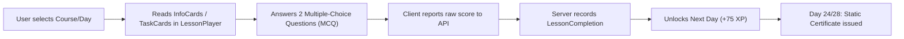
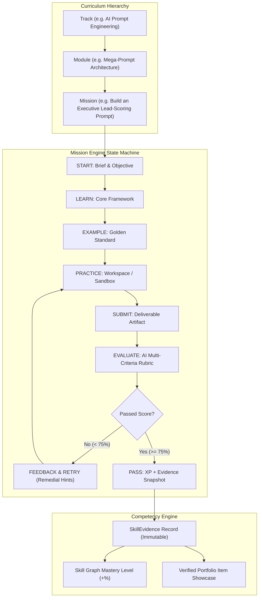
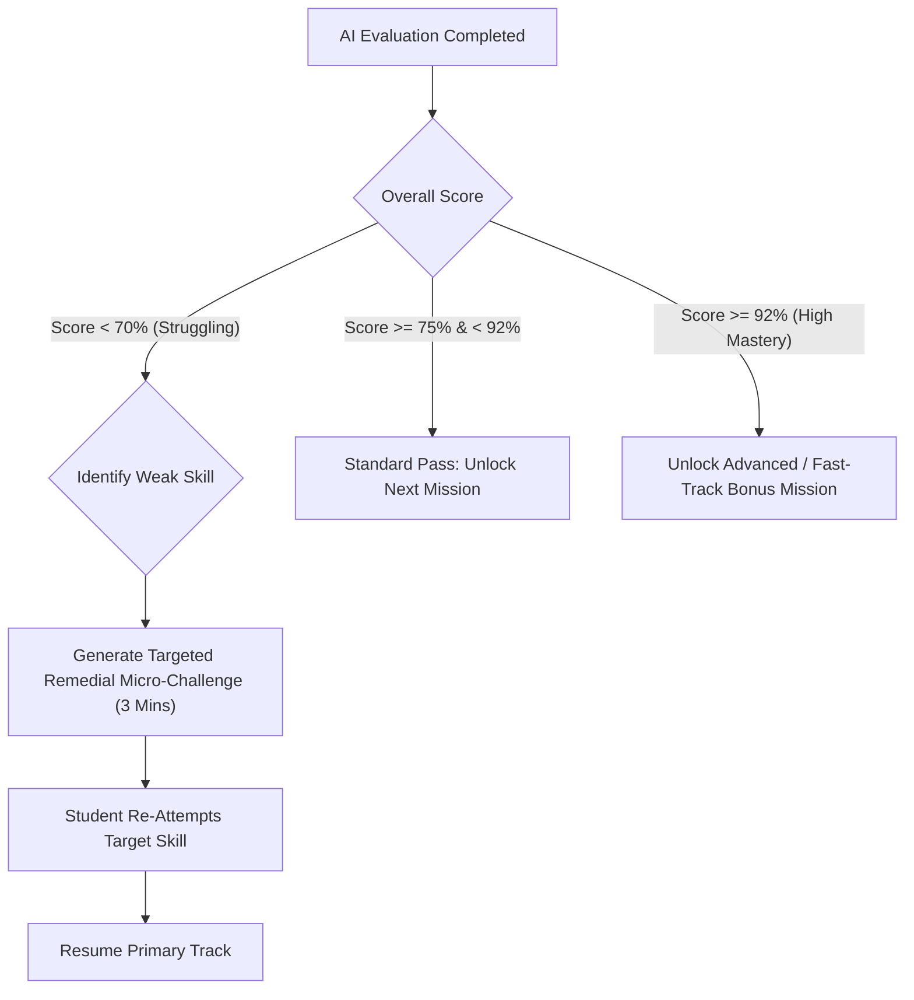
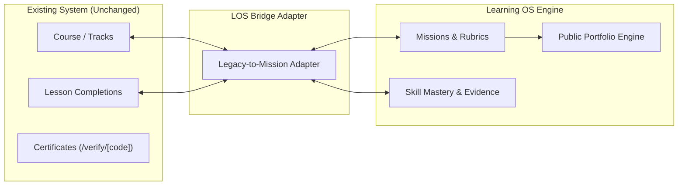

# Tawwerni Learning Operating System (LOS)
## Enterprise Architecture Specification & Migration Blueprint

> **Document Version:** 1.0.0  
> **Status:** Approved Architecture Draft  
> **Target System:** Tawwerni Platform (tawwerni.com)  
> **Authors:** Principal Product Architect & Senior Full-Stack Engineering Team  
> **Principle:** *Do NOT optimize for "Lessons completed". OPTIMIZE for "Skills demonstrated".*

---

## 1. Executive Summary & Vision

Tawwerni is evolving from an informational content platform into a **Personalized Learning Operating System (LOS)**. 

### The Strategic Imperative
In an era where Large Language Models (LLMs) like ChatGPT, Claude, and Gemini deliver infinite information on demand for free, **information alone has zero commercial differentiation**. A platform that merely presents written lessons and multiple-choice questions competes on information delivery—a race to the bottom.

**Tawwerni's Unfair Advantage:**
Tawwerni does not compete with ChatGPT on quantity of knowledge. Tawwerni uses AI as a pedagogical engine to deliver:
1. **Curated Action-First Curricula** (No fluff, high signal).
2. **Missions as the Atomic Unit of Progress** (Every unit produces a tangible artifact).
3. **Multi-Dimensional AI Evaluation & Rubrics** (Instant, constructive, structured feedback on student work).
4. **Demonstrated Skill Graph** (Skills are earned exclusively through verified performance, not passive consumption).
5. **Verified Student Portfolio & Proof of Work** (Public, verifiable evidence that lands jobs and freelance clients).
6. **Adaptive Remediation & Acceleration** (Dynamic pacing that catches weaknesses and rewards speed).

---

## 2. Current State Audit (Phase 1 Discovery)

### 2.1 Architectural Stack
- **Framework:** Next.js 16.3.8 (App Router), React 19, TypeScript 5.
- **Styling & Design System:** Tailwind CSS with custom cyberpunk/clean-glass aesthetic, full RTL/LTR bilingual support (`LanguageContext`).
- **ORM & Data Layer:** Prisma Client with MySQL backend (`prisma/schema.prisma`).
- **Authentication:** Custom stateless JWT inside an HTTP-only cookie (`tawwerni_session`) with `sessionVersion` invalidation.
- **Deployment & Server Environment:** Node.js standalone with edge/serverless middleware.

### 2.2 Current Learning Flow


### 2.3 Current Data Model Analysis
The current schema revolves around `Course -> Module -> Lesson -> LessonCompletion`:

| Entity | Purpose | Current Limitation |
| :--- | :--- | :--- |
| `User` | Stores profile, referral codes, password hashes, quiz diagnostic answers. | Lacks skill profile, portfolio settings, and mastery records. |
| `Course` | Represents tracks (e.g. `tahaddi-28-yawm`, 100 universal tracks). | Represents only course-level metadata; no competency or skill graph linkages. |
| `Module` | Groups 4–6 lessons under a thematic header. | Merely organizational; does not represent skill domains. |
| `Lesson` | Atomic learning unit identified by `dayNumber`. | **Passive unit:** Consists of slides (`LessonCard`) and recall questions (`QuizQuestion`). |
| `LessonCompletion` | Records completion: `score`, `totalQuestions`, `xpEarned`, `completedAt`. | **No evidence:** Stores only an integer score. No artifact, submission, or evaluation trail. |
| `Certificate` | Issues a cryptographically signed serial code at course completion. | States only that *lessons were completed*. Does not prove what projects were built. |

### 2.4 Existing Reusable Platform Assets
1. **Universal Course Loader (`src/lib/course-loader.ts`):** High-speed dual-loader supporting handcrafted courses and all 100 universal tracks.
2. **Card Visual Engine (`src/components/CardVisual.tsx`):** Rich interactive UI widgets (diagrams, flowcharts, code blocks, checklists) rendered inside lessons.
3. **Audio Dopamine Synthesizer (`playChime`):** Web Audio API synthesizer for real-time haptic-like micro-rewards (`pop`, `fanfare`, `milestone`).
4. **Certificate Verification System (`src/app/verify/[code]/page.tsx`):** Cryptographic code generator with QR code rendering and public lookup.
5. **AI Coach ("فهيم" - `src/app/api/chat/route.ts`):** Context-aware conversational mentor with student level, streak, and pace integration.
6. **Gamification Core (`src/lib/xp.ts`):** Proven calculations for XP tiers, streaks, level names, and week-dot calendar visualizers.

### 2.5 Critical Gaps & Bottlenecks
1. **Passive "Read-and-Click" Bias:** Progress is currently granted when a user clicks through cards and guesses MCQs.
2. **Zero Proof-of-Work Artifacts:** Users do not submit actual deliverables (prompts, copy, code, proposals, spreadsheets, designs).
3. **Absence of a Competency Graph:** No understanding of granular skills (e.g. *Prompt Formatting*, *Role Prompting*, *Negative Constraints*).
4. **Client-Trusted Evaluation:** The client currently reports `score` in request body.
5. **Binary Linear Pacing:** Everyone progresses at the exact same pace regardless of whether they struggled or excelled.
6. **No Portfolio Engine:** No mechanism exists for students to showcase projects to clients on Upwork or LinkedIn.

---

## 3. The Core Learning Operating System Architecture

The fundamental shift transitions Tawwerni from a **Content Reader** to an **Execution & Mastery Engine**.

```
OLD PARADIGM: Track ➔ Module ➔ Lesson ➔ MCQ Quiz ➔ Lesson Completed
NEW PARADIGM: Track ➔ Module ➔ Mission ➔ Practice ➔ Submission ➔ AI Evaluation ➔ Skill Evidence ➔ Portfolio Project
```



---

## 4. Entity Relationship & Data Model (Phase 2)

To maintain **100% backward compatibility**, the existing tables (`Course`, `Module`, `Lesson`, `LessonCompletion`, `Certificate`) remain completely intact. The new LOS models layer cleanly on top:

### 4.1 Prisma Schema Additions

```prisma
// ==========================================
// TAWWERNI LEARNING OPERATING SYSTEM MODELS
// ==========================================

model Skill {
  id          String   @id @default(cuid())
  slug        String   @unique
  nameAr      String
  nameEn      String
  domain      String   // "ai", "freelancing", "marketing", "code", etc.
  description String   @db.Text
  icon        String   @default("⚡")
  level       Int      @default(1) // 1 = Fundamental, 2 = Intermediate, 3 = Advanced, 4 = Master
  createdAt   DateTime @default(now())

  prerequisites SkillPrerequisite[] @relation("DependentSkills")
  dependents    SkillPrerequisite[] @relation("RequiredSkills")
  missionSkills MissionSkill[]
  evidences     SkillEvidence[]
  userMasteries UserSkillMastery[]

  @@index([domain, level])
}

model SkillPrerequisite {
  id              String @id @default(cuid())
  skillId         String
  requiredSkillId String

  skill         Skill @relation("DependentSkills", fields: [skillId], references: [id], onDelete: Cascade)
  requiredSkill Skill @relation("RequiredSkills", fields: [requiredSkillId], references: [id], onDelete: Cascade)

  @@unique([skillId, requiredSkillId])
}

model UserSkillMastery {
  id             String    @id @default(cuid())
  userId         String
  skillId        String
  masteryPercent Int       @default(0) // 0 to 100
  evidenceCount  Int       @default(0)
  confidence     Float     @default(0.0) // 0.0 to 1.0 statistical confidence
  lastTestedAt   DateTime?
  updatedAt      DateTime  @updatedAt

  user  User  @relation(fields: [userId], references: [id], onDelete: Cascade)
  skill Skill @relation(fields: [skillId], references: [id], onDelete: Cascade)

  @@unique([userId, skillId])
  @@index([userId, masteryPercent])
}

model Mission {
  id                 String   @id @default(cuid())
  slug               String   @unique
  moduleId           String?
  lessonId           String?  // Optional bridge to existing Lesson row
  order              Int      @default(1)
  titleAr            String
  titleEn            String
  objectiveAr        String   @db.Text
  objectiveEn        String   @db.Text
  estimatedMinutes   Int      @default(15)
  difficulty         String   @default("intermediate") // "beginner" | "intermediate" | "advanced"
  xpReward           Int      @default(100)
  passingScore       Int      @default(75) // Percentage threshold
  maxRetries         Int      @default(5)
  
  // Structured Mission Content
  briefContentAr     String   @db.Text
  briefContentEn     String   @db.Text
  goldenExampleAr    String   @db.Text
  goldenExampleEn    String   @db.Text
  instructionsAr     String   @db.Text
  instructionsEn     String   @db.Text
  deliverableType    String   @default("text") // "prompt" | "text" | "code" | "url" | "file"
  
  // Evaluation Rubric (JSON array of criteria)
  rubricJson         String   @db.Text 
  isCapstone         Boolean  @default(false)
  createdAt          DateTime @default(now())

  skills             MissionSkill[]
  submissions        Submission[]
  evidences          SkillEvidence[]
  portfolioItems     PortfolioItem[]

  @@index([difficulty])
}

model MissionSkill {
  id        String @id @default(cuid())
  missionId String
  skillId   String
  weight    Float  @default(1.0) // Relative importance in this mission

  mission Mission @relation(fields: [missionId], references: [id], onDelete: Cascade)
  skill   Skill   @relation(fields: [skillId], references: [id], onDelete: Cascade)

  @@unique([missionId, skillId])
}

model Submission {
  id               String   @id @default(cuid())
  userId           String
  missionId        String
  attemptNumber    Int      @default(1)
  content          String   @db.Text // User artifact submission
  artifactUrl      String?  // External repo, live link, or screenshot
  status           String   @default("evaluating") // "evaluating" | "passed" | "needs_revision"
  score            Int      @default(0) // 0-100
  evaluatorModel   String   @default("claude-sonnet-5")
  evaluatorVersion String   @default("1.0.0")
  feedbackJson     String   @db.Text // Structured JSON feedback
  submittedAt      DateTime @default(now())
  evaluatedAt      DateTime?

  user      User            @relation(fields: [userId], references: [id], onDelete: Cascade)
  mission   Mission         @relation(fields: [missionId], references: [id], onDelete: Cascade)
  evidences SkillEvidence[]

  @@index([userId, missionId])
  @@index([status])
}

model SkillEvidence {
  id           String   @id @default(cuid())
  userId       String
  skillId      String
  missionId    String
  submissionId String
  scoreEarned  Int      // 0-100
  artifactExcerpt String @db.Text // Snippet of the proven work
  evaluatorMeta   String @db.Text
  createdAt    DateTime @default(now())

  user       User       @relation(fields: [userId], references: [id], onDelete: Cascade)
  skill      Skill      @relation(fields: [skillId], references: [id], onDelete: Cascade)
  mission    Mission    @relation(fields: [missionId], references: [id], onDelete: Cascade)
  submission Submission @relation(fields: [submissionId], references: [id], onDelete: Cascade)

  @@index([userId, skillId])
}

model PortfolioItem {
  id            String   @id @default(cuid())
  userId        String
  missionId     String
  submissionId  String
  titleAr       String
  titleEn       String
  descriptionAr String   @db.Text
  descriptionEn String   @db.Text
  artifactContent String @db.Text
  artifactUrl   String?
  skillsSnapshot String  @db.Text // JSON snapshot of demonstrated skills & scores
  isPublic      Boolean  @default(true)
  featuredOrder Int      @default(0)
  createdAt     DateTime @default(now())
  updatedAt     DateTime @updatedAt

  user    User    @relation(fields: [userId], references: [id], onDelete: Cascade)
  mission Mission @relation(fields: [missionId], references: [id], onDelete: Cascade)

  @@index([userId, isPublic])
}
```

---

## 5. The Mission Engine Execution Lifecycle (Phase 3)

The Mission Engine governs how a student moves from instruction to proof of competence.

### 5.1 State Transitions
```
[START] ➔ [LEARN] ➔ [EXAMPLE] ➔ [PRACTICE] ➔ [SUBMIT] ➔ [EVALUATE] 
                                                    │
                   ┌────────────────────────────────┴────────────────────────┐
                   ▼                                                         ▼
         [NEEDS_REVISION]                                                  [PASSED]
                   │                                                         │
             [FEEDBACK]                                              [GENERATE_EVIDENCE]
                   │                                                         │
             [RETRY_LOOP]                                            [UPDATE_MASTERY]
                   │                                                         │
                   └───────────➔ [PRACTICE]                           [UNLOCK_NEXT / PORTFOLIO]
```

### 5.2 The 3 Core Student Questions
At every step of any mission, the UI guarantees that the learner immediately knows:
1. **"What am I trying to accomplish?"** ➔ Crystal-clear objective and real-world workplace context.
2. **"What will I produce?"** ➔ Exact deliverable specification (e.g. *"A 3-part high-ticket proposal addressing scope creep"*).
3. **"How will I know I succeeded?"** ➔ Transparent, published rubric criteria (e.g. *Specificity ≥ 80%*, *Constraints Handled ≥ 75%*).

---

## 6. Demonstrated Skill Graph & Mastery Mechanics (Phase 4 & 5)

### 6.1 The Formula for Skill Mastery
Mastery percentage is never incremented by reading or opening lessons. It is calculated by the server using an **exponentially weighted moving average of verified evidence scores**:

$$\text{Mastery}(s) = \min\left(100, \; \sum_{i=1}^{n} w_i \cdot \text{Score}_i \cdot \text{Confidence}(n)\right)$$

Where:
- $\text{Score}_i$ is the rubric score on evidence item $i$ (0 to 100).
- $w_i$ is the recency weight ($w_1 > w_2 > \dots > w_n$).
- $\text{Confidence}(n) = 1 - e^{-0.45 \cdot n}$ ensures that a single lucky submission cannot yield 100% mastery without consistent multi-mission demonstration.

### 6.2 Immutable Server-Side Authority
- **Zero Client-Side Authority:** Clients can only submit strings/blobs representing work.
- **Server Attribution:** All grading, XP calculations, streak increments, and badge awards happen inside transactional server mutations.

---

## 7. AI Evaluation Service Specification (Phase 6)

The evaluation service executes under strict deterministic constraints:
- **Zero Free-Form Markdown Decision Making:** The LLM evaluator must output strict JSON conforming to our Zod schema.
- **Auditable Traceability:** Every evaluation logs the prompt version, model identifier (`claude-sonnet-5`), rubric version, and raw evaluation reasoning.

### 7.1 Evaluation Contract Interface

```typescript
export interface RubricCriterion {
  id: string;
  name: string;
  weight: number; // e.g. 0.35
  description: string;
  scoringGuide: {
    excellent: string; // 90-100
    competent: string; // 75-89
    needsWork: string;  // < 75
  };
}

export interface EvaluationInput {
  missionId: string;
  missionTitle: string;
  objective: string;
  rubric: RubricCriterion[];
  submissionContent: string;
  userContext: {
    priorAttempts: number;
    targetSkills: { id: string; name: string }[];
  };
}

export interface EvaluationResult {
  score: number; // 0 to 100 (weighted sum)
  passed: boolean; // score >= passingScore
  skillScores: Record<string, number>; // skillId -> score
  criteriaScores: {
    criterionId: string;
    score: number;
    reasoning: string;
  }[];
  strengths: string[];
  weaknesses: string[];
  feedback: {
    summary: string;
    actionableFix: string;
    encouragement: string;
  };
  nextAction: "unlock_next" | "retry_practice" | "remedial_reinforce";
  evaluatorMeta: {
    model: string;
    promptVersion: string;
    timestamp: string;
  };
}
```

---

## 8. Adaptive Remediation & Acceleration (Phase 7)



1. **Remedial Path:** If a student scores below 70% in a fundamental criterion (e.g. *Prompt Constraints*), the engine surfaces a targeted 3-minute remedial micro-exercise with explicit diagnostic hints before allowing progression.
2. **Accelerated Path:** Students scoring $\ge 92\%$ with high confidence unlock "Pro Capstone Challenges" that award extra XP and premier placement in the Public Portfolio.

---

## 9. Verified Student Portfolio Engine (Phase 8)

### 9.1 Public Verification Endpoint (`/p/[username]` or `/verify/project/[id]`)
Instead of an abstract certificate claiming "Student finished 24 days", the student's portfolio showcases:
- **Verified Deliverable:** Live interactive output or formatted artifact.
- **Skill Badges with Performance Percentiles:** *"Advanced Meta-Prompting (94th Percentile)"*.
- **Cryptographic Audit Hash:** Proof that the deliverable was evaluated and approved by Tawwerni LOS.
- **Direct Share Links:** One-click integration for LinkedIn certificates, Upwork proposal attachments, and CV QR codes.

---

## 10. Learner Dashboard Transformation: Centered on "TODAY" (Phase 9)

The current dashboard displays a catalog of course tiles. The redesigned LOS Dashboard orients the student entirely around **Immediate Focused Action**:

### Key Sections:
1. **The Hero Action ("Today's Mission"):**
   - Active Mission Title & Objective.
   - Estimated Time (e.g. *⏱️ 12 Minutes*).
   - Target Skill to be demonstrated.
   - Big Primary Action: `[ 🚀 Execute Today's Mission ]`.
2. **Competency Radar / Skill Mastery Barometer:**
   - Top Mastered Skills.
   - Skill Needing Attention (with 1-click remedial practice button).
3. **Evidence Counter & Portfolio Growth:**
   - Total Verified Artifacts Produced (e.g. *14 Live Projects*).
4. **Streak & Momentum Tracker:**
   - Unbroken habit streak with freeze protection and daily XP progress.

---

## 11. Migration Strategy & Zero-Downtime Compatibility (Phase 10)



### Safety & Integrity Commitments:
1. **Zero Table Drops:** No legacy tables, columns, or relations are removed or renamed.
2. **Preserved Progress:** Every existing `LessonCompletion` maps cleanly to legacy progress counters.
3. **Graceful Upgrades:** Handcrafted and universal courses gain mission bindings incrementally without breaking any active student sessions.
4. **Isolated Transactions:** All evaluations and evidence writes execute in isolated database transactions.

---

## 12. Risk Assessment & Mitigation Matrix

| Risk Factor | Impact | Mitigation Strategy |
| :--- | :---: | :--- |
| **API Cost Spike from LLM Evaluator** | Medium | Strict token limits (max 500 tokens input/output), server-side per-user rate limiting, and local caching of identical submissions. |
| **LLM Output Hallucination / Invalid JSON** | High | Strict Zod runtime schema validation with automatic single-retry fallback to deterministic rubric grading. |
| **Increased Cognitive Load on Students** | High | 4-step progressive disclosure (Objective ➔ Example ➔ Practice ➔ Submit) ensuring micro-commitments remain under 15 minutes. |
| **Database Migration Friction** | Low | Additive migrations only (new models with optional foreign keys to legacy tables). No lock contention. |

---

## 13. Phased Implementation Roadmap & Live Deployment Status

- **Phase 1 (Complete):** Full architectural audit, codebase discovery, and Master Architecture Blueprint artifact.
- **Phase 2 (Complete):** Core Competency Skill Trees Engine (`src/content/skill-trees.ts`) supporting hero tracks and dynamic synthesis across all 100 universal tracks.
- **Phase 3 (Complete):** Mission Adapter (`src/lib/mission-adapter.ts`) translating lessons into execution units with the 3 Core Student Questions, Golden Benchmarks, and Rubrics.
- **Phase 4 (Complete):** AI Evaluation Service (`src/lib/mission-evaluator.ts`) & API route (`/api/missions/evaluate`) with non-discouraging "Not yet" feedback loops and zero-downtime database sync.
- **Phase 5 (Complete):** Interactive Progressive Disclosure Mission Player (`src/components/MissionPlayer.tsx`) with Web Audio sensory dopamine chimes, keyboard shortcuts, and dual-mode toggle with classic cards (`?mode=cards`).
- **Phase 6 (Complete):** Learner Dashboard overhaul (`src/app/app/page.tsx` & `src/components/StudentDashboardView.tsx`) structured around "ONE MISSION AT A TIME", Visual Skill Maps, Proof-of-Work Projects, and Weak Skill Reinforcement.
- **Phase 7 (Next Step):** Dedicated public student portfolio gallery (`/p/[username]`) with cryptographic verification badges.

---
*Authored with precision for Tawwerni's evolution into the premier Learning Operating System in the Arab world.*
