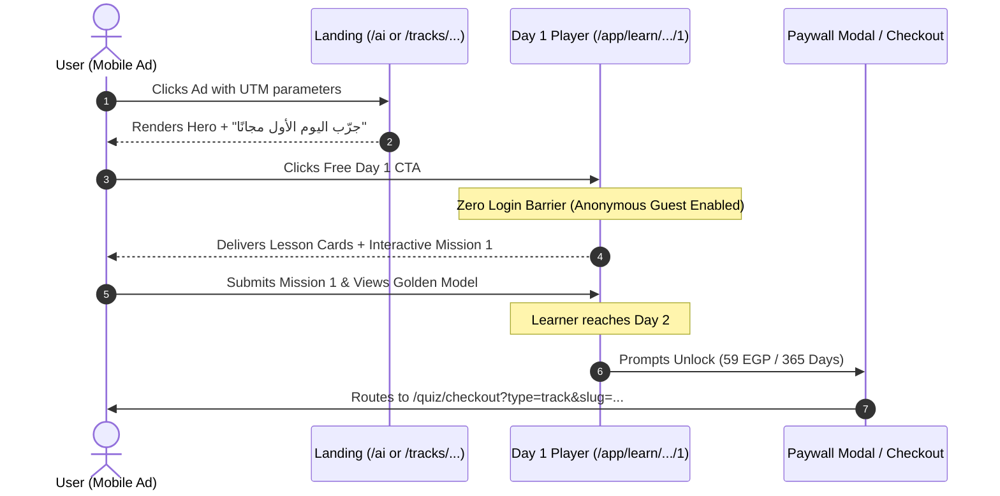

# LANDING PAGE DESTINATION MAP & MESSAGE MATCH ARCHITECTURE

## 1. Destination Strategy: Intent Landing vs Direct Product Page
When running paid cold traffic, sending users to an ambiguous homepage is the fastest way to burn capital. We have two candidate destinations for the Prompt Engineering campaign:

```
Cold Ad (Problem / Mistake Angle)
           │
           ├── Variant A (Intent Landing):  https://tawwerni.com/ai
           │
           └── Variant B (Product Page):   https://tawwerni.com/tracks/prompt-engineering-mastery
```

### Destination A/B Evaluation Framework:

| Criteria | Intent Landing (`/ai`) | Direct Product Page (`/tracks/prompt-engineering-mastery`) |
| :--- | :--- | :--- |
| **Primary Strength** | Rich educational context, vertical curriculum preview, answers objections. | Maximum velocity, minimal distraction, direct focus on Track #1. |
| **Best Audience Fit** | Broad audiences needing mindset and mechanism framing. | Tech-aware audiences who already know what Prompt Engineering is. |
| **Friction Level** | Low (has direct Day 1 CTA, curriculum accordion, FAQ, and 59 EGP breakdown). | Lowest (immediate track breakdown, syllabus, and instant start button). |
| **Starting Recommendation**| **Primary Default (Variant A)** for the initial Broad & Interest ad sets. | **A/B Split Test (Variant B)** after establishing the baseline. |

---

## 2. Message Match Matrix (No Bait-and-Switch)

If the cold ad promises a solution to a specific pain point, the landing page above-the-fold experience **must immediately mirror and validate that expectation**:

```
Ad Hook: "ليه كل ما تطلب حاجة من ChatGPT بتاخد إجابة شكل؟"
                     ↓
Landing Hero Badge: "منظومة التعلم بالمهام اليومية المركزة"
Landing Headline:   "خلّي أدوات الذكاء الاصطناعي تفهمك من أول مرة"
Landing Subtitle:   "اتعلم هندسة الأوامر المتقدمة (Prompt Engineering) من خلال مهام تطبيقية مدتها 10 دقائق يومياً."
Primary Cold CTA:   "جرّب اليوم الأول مجانًا بدون تسجيل مسبق ←"
Commercial Offer:   "اشتراك سنوي بـ 59 ج.م لمدة 365 يوماً · بدون تجديد تلقائي"
```

---

## 3. Structural Page Breakdown (`/ai` Landing Architecture)

1. **Hero Section (Above the Fold)**:
   * High-contrast value proposition: *"خلّي أدوات الذكاء الاصطناعي تفهمك من أول مرة"*.
   * Clear mechanism: 28 daily missions, 10 minutes a day, practical output.
   * Primary Action: **"جرّب اليوم الأول مجانًا"** linking directly to `/app/learn/prompt-engineering-mastery/1`.
   * Secondary Action: "خطة الـ 28 يوماً والتسعير".

2. **The Friction Diagnosis (The Pain)**:
   * Why generic prompts fail (treating AI like a search engine, hallucination, lack of constraints).
   * Why passive video courses fail (watching for 3 hours and retaining nothing).

3. **The Tawwerni Method (The Daily Loop)**:
   * 1 Micro-Lesson (5 min).
   * 1 Hands-On Mission (10 min).
   * Immediate Golden Model Comparison.

4. **Product Proof & Curriculum Syllabus**:
   * Complete 28-day roadmap broken into 4 progressive weeks.
   * Day 1 preview card showing real lesson objectives and mission deliverables.

5. **Capstone Portfolio Project**:
   * *Megaprompt Architecture Deck*: 5 documented business prompts ready for client or workplace deployment.

6. **Transparent Commercial Offer**:
   * Single Track: **59 EGP / 365 days** (One-time payment).
   * Optional Full Career Path: **149 EGP / 365 days** (AI & Automation Specialist).
   * 3-Day Money-Back Guarantee under fair digital consumption terms.

7. **Direct Payment & Reassurance FAQ**:
   * How Vodafone Cash & InstaPay transfers are verified.
   * Confirmation that Day 1 is free without entering bank cards or personal details.

---

## 4. The Direct Free Day 1 User Flow

To honor the core promise ("اليوم الأول مجانًا"), the flow from ad click to active learning is frictionless:



---

## 5. Mobile Web Performance & Core Web Vitals Standards

Over 85% of traffic from Meta paid ads in Egypt arrives via mobile devices over cellular networks (4G/3G). Landing page load speed directly dictates CPC and bounce rates.

### Strict Performance Targets:
* **Largest Contentful Paint (LCP)**: $\le 2.0\text{ seconds}$ on mobile.
* **Interaction to Next Paint (INP)**: $\le 200\text{ ms}$.
* **Cumulative Layout Shift (CLS)**: $\le 0.05$ (zero layout shifting during asset render).
* **Asset Optimization**: Next.js WebP/AVIF compression for cover images, zero blocking third-party scripts.

---

## 6. Full Vertical Landing Page Directory (Phase B Rollout Map)

| Category / Vertical | Canonical Landing Route | Anchor Track Slug | Track Title (AR) |
| :--- | :--- | :--- | :--- |
| **الذكاء الاصطناعي (AI)** | `/ai` | `prompt-engineering-mastery` | هندسة الأوامر المتقدمة (Track #1) |
| **العمل الحر (Freelancing)**| `/freelancing` | `zero-to-first-dollar-freelancer` | من الصفر إلى أول دولار فريلانس (Track #31) |
| **التسويق الرقمي (Marketing)**| `/digital-marketing` | `integrated-digital-marketing-strategy` | استراتيجية التسويق الرقمي المتكامل (Track #41) |
| **البرمجة (Coding)** | `/coding` | `modern-coding-fundamentals` | أساسيات البرمجة والتفكير المنطقي (Track #11) |
| **التصميم (Design)** | `/design` | `ui-ux-design-figma` | أساسيات وتصميم تجربة المستخدم (Track #51) |
| **تحليل البيانات (Data)** | `/data` | `data-driven-decision-making` | اتخاذ القرارات المبنية على البيانات (Track #21) |
| **الإنتاجية (Productivity)** | `/productivity` | `atomic-habits-relentless-focus` | العادات الذرية والتركيز المستمر (Track #91) |
| **الأمن السيبراني (Security)**| `/cybersecurity` | `personal-cyber-hygiene-opsec` | الحماية الرقمية والخصوصية الشخصية (Track #71) |
| **النمو المهني (Career)** | `/career` | `career-transitions-adaptability` | التحول المهني والمرونة الوظيفية (Track #81) |
