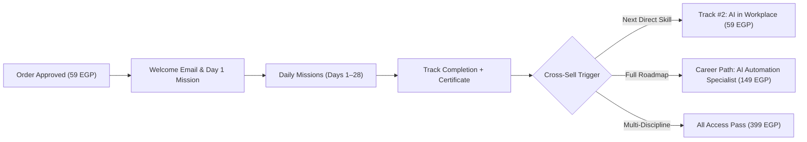

# RETARGETING SEQUENCING & CUSTOMER LIFECYCLE ENGINE

## 1. Retargeting Strategy & Audience Segments
Cold traffic rarely buys on the first click. A respectful, disciplined retargeting sequence recovers high-intent learners who dropped off due to distraction, lack of time, or friction at payment.

```
Cold Ad Traffic
       │
       ├── Stage 1: Video Viewers / Landing Visitors (Watched ≥ 50% or read LP)
       │
       ├── Stage 2: Quiz Completers (Identified best-fit track but didn't open Day 1)
       │
       ├── Stage 3: Free Day Starters (Experienced Day 1 mission, hit Day 2 paywall)
       │
       └── Stage 4: Checkout Initiators (Reached /quiz/checkout, order pending or abandoned)
```

---

## 2. Audience Segmentation & Exclusion Rules

| Custom Audience Name | Data Source | Duration Window | Exclusion Criteria |
| :--- | :--- | :---: | :--- |
| **`AUD_RTG_VID_ENGAGED`** | Video ThruPlay ($\ge 15\text{s}$) or $50\%$ | 14 Days | Exclude all purchasers & checkout starters |
| **`AUD_RTG_LP_VISITORS`** | Visited `/ai` with duration $> 15\text{s}$ | 14 Days | Exclude all purchasers |
| **`AUD_RTG_QUIZ_DONE`** | Fired `Lead` on `/quiz` | 30 Days | Exclude all purchasers |
| **`AUD_RTG_FREEDAY_STARTED`**| Fired `free_day_started` | 30 Days | Exclude all purchasers |
| **`AUD_RTG_CHECKOUT_ABANDON`**| Fired `InitiateCheckout` | 7 Days | Exclude all purchasers |
| **`AUD_EXCLUDE_PURCHASERS`** | Fired **`Purchase`** (or entitlement active) | **180 Days** | **ALWAYS EXCLUDED FROM ACQUISITION** |

> **NON-NEGOTIABLE RULE**: Confirmed buyers must NEVER see acquisition ads for a product they already own. That wastes budget and diminishes brand trust.

---

## 3. Retargeting Message Sequences (No Fake Scarcity)

### Retargeting Sequence 01: Quiz Completers
* **Target Audience**: `AUD_RTG_QUIZ_DONE`
* **Trigger**: Completed assessment but did not launch Day 1.
* **Core Angle**: Frictionless reminder of their tailored result.
* **Ad Copy**:
  > فاكر نتيجتك في اختبار تحديد المسار؟
  >
  > طلع لك إن أنسب مهارة تبدأ بيها هي "هندسة الأوامر المتقدمة" (Prompt Engineering).
  >
  > لسه تقدر تبدأ مهمة اليوم الأول مجانًا تمامًا بدون ما تسجل حساب وبدون كارت بنكي.
  >
  > [ابدأ خطوتك الأولى مجانًا ←](https://tawwerni.com/ai?utm_source=meta&utm_medium=retargeting&utm_campaign=tw_ads_v1_ai&utm_term=rtg_quiz&utm_content=quiz_reminder01)

---

### Retargeting Sequence 02: Free Day 1 Starters
* **Target Audience**: `AUD_RTG_FREEDAY_STARTED`
* **Trigger**: Completed Lesson 1 or attempted Mission 1, reached the Day 2 unlock barrier.
* **Core Angle**: Clear value reinforcement & low barrier to complete the remaining 27 days.
* **Ad Copy**:
  > جربت أول خطوة عملية في مسار هندسة الأوامر، وشفت إزاي برومبت مهيكل واحد بيفرق في مخرجات الذكاء الاصطناعي؟
  >
  > باقي 27 مهمة يومية مركزة تنتهي بمشروع تخرج توثقه في بورتفوليو أعمالك (Megaprompt Architecture Deck) وشهادة إتمام برمز QR.
  >
  > المسار كامل بـ 59 ج.م فقط لسنة كاملة (365 يوماً) وبدون أي تجديد تلقائي.
  >
  > [كمّل مسارك بـ 59 ج.م ←](https://tawwerni.com/quiz/checkout?type=track&slug=prompt-engineering-mastery&utm_source=meta&utm_medium=retargeting&utm_campaign=tw_ads_v1_ai&utm_term=rtg_freeday&utm_content=freeday_complete02)

---

### Retargeting Sequence 03: Checkout Starters (Cart Abandonment)
* **Target Audience**: `AUD_RTG_CHECKOUT_ABANDON`
* **Trigger**: Loaded `/quiz/checkout`, viewed Vodafone Cash / InstaPay instructions, but transfer hasn't cleared.
* **Core Angle**: Assistance, reassurance, and friction removal. **Zero artificial timers or fake countdowns.**
* **Ad Copy**:
  > طلب اشتراكك في مسار "هندسة الأوامر المتقدمة" لسه محفوظ.
  >
  > لو قابلتك أي مشكلة في التحويل عبر فودافون كاش أو إنستاباي، أو حابب تتأكد من أي خطوة: فريق الدعم متواجد معاك مباشرة على واتساب.
  >
  > تقدر تكمل اشتراكك بـ 59 ج.م في أي وقت وتفعل حسابك فوراً.
  >
  > [إتمام الاشتراك من حيث توقفت ←](https://tawwerni.com/quiz/checkout?type=track&slug=prompt-engineering-mastery&utm_source=meta&utm_medium=retargeting&utm_campaign=tw_ads_v1_ai&utm_term=rtg_checkout&utm_content=cart_saved03)

---

## 4. Anti-Fatigue & Frequency Capping Protocol
1. **Frequency Cap**: Set custom rules in Meta Ads Manager to cap impressions at **maximum 3 to 4 impressions per 7 days** for any user in retargeting audiences.
2. **Creative Rotation**: If a user is in `AUD_RTG_LP_VISITORS` for 10 days without purchasing, automatically rotate to a different creative angle (e.g., from Problem Angle to Static Proof).
3. **Burnout Window**: After 21 days of inactivity across retargeting touchpoints, automatically purge the user from active paid retargeting to protect unit economics.

---

## 5. Post-Purchase Nurturing & Second-Sale Flywheel

Once an order is approved and entitled, the user enters the **Learner Retention Sequence**:



* **Immediate Post-Purchase (0–48 hours)**: Welcome email with direct link to Day 1 mission. **Never pitch another product immediately after checkout.**
* **Mid-Course Milestone (Day 14)**: Prompt Vault reminder (if user didn't take the +199 bump).
* **Track Completion (Day 28)**: Issue QR-verifiable certificate and capstone portfolio template. Then present the **Next Best Skill**: Track #2 (`ai-workplace-productivity`) or the full 149 EGP Career Path (`ai-automation-specialist`).
