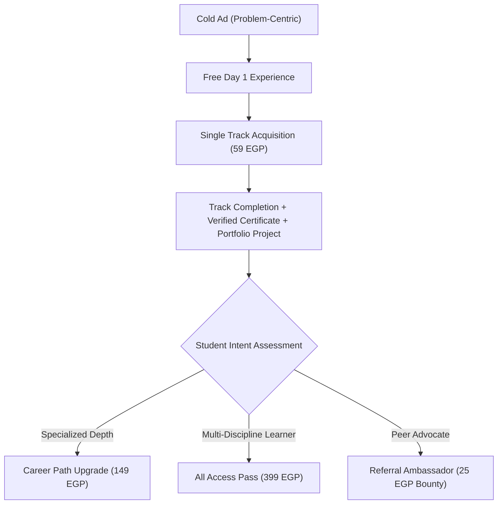

# TAWWERNI ADS V1: STRATEGY & MARKET VALIDATION MASTERPLAN

## 1. Executive Mission
Tawwerni is technically mature, fully authored, and legally audited. With 100 tracks, 12 career paths, 2,181 interactive lessons and missions, a verified Day 1 free trial, and active Vodafone Cash / InstaPay manual activation pipelines, the platform has completed the **PRODUCT READY** phase.

The objective of **TAWWERNI ADS V1** is simple:
> **Convert Tawwerni from "Product Ready" to "Market-Validated".**
> Discover what real Egyptian customers will actually pay for, what messaging converts cold traffic into paying learners, and build an interpretable, repeatable acquisition engine.

---

## 2. Canonical Commercial Truth (Non-Negotiable)
The commercial model is fixed and must remain unchanged throughout all Phase B acquisition experiments:

| Product Tier | Official Price | Access Duration | Auto-Renewal | Key Value Proposition |
| :--- | :---: | :---: | :---: | :--- |
| **Individual Track** | **59 EGP** | 365 Days | **None** (One-time) | Focus on 1 concrete skill in 28 daily missions |
| **Career Path** | **149 EGP** | 365 Days | **None** (One-time) | Multi-stage roadmap with unified capstone project |
| **All Access Pass** | **399 EGP** | 365 Days | **None** (One-time) | Unrestricted library access + VIP Prompt Vault included |
| **First Day Trial** | **FREE** | Instant | N/A | Immediate anonymous access without login wall |
| **Prompt Vault** | **+199 EGP** | Included / Add-on | N/A | 10,000 production prompt templates & workflows |
| **Referral Bounty** | **25 EGP** | Per paid referral | N/A | 100 EGP minimum withdrawal threshold |
| **Digital Refund** | **3 Days** | Fair Consumption | N/A | Full money-back if $\le 3$ missions completed & no cert |

---

## 3. Core Positioning Architecture
### What Tawwerni is NOT:
* **NOT** a massive generic course library ("عالم من الكورسات").
* **NOT** hours of passive video lectures to be abandoned after day two.
* **NOT** an unrealistic get-rich-quick promise or guaranteed employment scheme.

### What Tawwerni IS:
> **"تعلم مهارة عملية بخطوات يومية مركزة (5–15 دقيقة)، طبّق مهمة تنفيذية، ابنِ مخرجاً ملموساً لملف أعمالك، واعرف خطوتك التالية."**

### Core Learning Mechanism (The Daily Loop):
$$\text{Micro-Lesson (5–10 min)} \longrightarrow \text{Actionable Mission} \longrightarrow \text{Golden Model Feedback} \longrightarrow \text{Documented Deliverable}$$

Advertising messaging must rigorously respect this mechanism:
$$\text{Concrete Problem} \longrightarrow \text{Micro-Skill} \longrightarrow \text{Daily Practice} \longrightarrow \text{Tangible Deliverable}$$

---

## 4. Hierarchy of Acquisition Objectives

### Primary North-Star Metric:
* **CONFIRMED PAID CUSTOMER** ($\text{Purchase Event}$: payment verified by operator + account entitled).

### Supporting Diagnostic Funnel Stages:
1. **Traffic Quality**: Landing Page Views & Scroll Depth ($\ge 50\%$).
2. **Value Discovery**: Free Day 1 Started (anonymous or registered).
3. **Intent Signal**: Interactive Quiz Completed.
4. **Commercial Intent**: Checkout Started (`InitiateCheckout`).
5. **Payment Commitment**: Payment Instructions Viewed & Order Submitted (`PaymentInitiated`).
6. **Commercial Validation**: Payment Confirmed (`Purchase`).
7. **Engagement & Retention**: Track Completion & Capstone Deliverable Built.
8. **Flywheel Expansion**: Second Track Purchase or Career Path Upgrade.

---

## 5. Experimentation Principles: Controlled & Interpretable
We reject fragmented launches (testing 10 products, 6 categories, and 50 ad sets simultaneously). Multi-variable noise guarantees uninterpretable data.

### Experiment Rule of One:
* **ONE Primary Product**: Advanced Prompt Engineering (`prompt-engineering-mastery`).
* **ONE Primary Funnel**: Direct problem-first angle to Day 1 Free Trial $\rightarrow$ 59 EGP annual unlock.
* **ONE Primary Geography**: Egypt (Arabic speakers).
* **Controlled Creative Matrix**: 3 specific angles (Problem, Mistake, Transformation).

Only after a statistical baseline is established (minimum 30–50 checkout starts and stable conversion benchmarks) will Hero Product #2 (`ai-workplace-productivity`) or category tests be introduced.

---

## 6. Funnel Diagnostics & Troubleshooting Decision Tree

When campaign data accumulates, diagnose bottlenecks according to this strict rubric:

| Funnel Symptom | Diagnosis | Immediate Action |
| :--- | :--- | :--- |
| **High CTR, Low Landing CVR** | Message Mismatch or Slow Load | Audit mobile LCP; align landing headline with ad hook verbatim. |
| **High Landing CVR, Low Day 1 Starts** | Friction in Trial Experience | Clarify "No signup required" badge; verify direct Day 1 button route. |
| **High Day 1 Starts, Low Checkout** | Value-to-Price Disconnect | Strengthen Day 1 mission golden sample; highlight 59 EGP for 365 days. |
| **High Checkout Starts, Low Orders** | Payment Friction or Hesitation | Clarify Vodafone Cash & InstaPay instructions; reassure on WhatsApp support. |
| **High Orders, Low Completed Transfers** | Follow-Up Drop-Off | Audit WhatsApp transfer confirmation speed; automate reminder email. |
| **High Purchases, Low Mission 1 Completion**| Onboarding / First Run Failure | Streamline Day 1 UI; ensure AI Coach prompt gives instant encouragement. |

---

## 7. Unit Economics & Contribution Margin Framework

Every campaign decision must be evaluated on **Net Contribution Margin**, not superficial ROAS or gross revenue.

### Per-Unit Economics (Single Track: 59 EGP):
* **Gross Order Value (Base Track)**: $59.00\text{ EGP}$
* **Blended AOV (with 20% Prompt Vault bump @ 199 EGP)**: $59 + (0.20 \times 199) = 98.80\text{ EGP}$
* **Payment Processing Costs (Vodafone/InstaPay)**: $\sim 0.00\text{ EGP}$ (direct wallet transfers)
* **Direct Server / LLM API Costs per active user**: $\approx 6.50\text{ EGP}$
* **Target Breakeven CPA**: $\approx 52.50\text{ EGP}$ (base) or $\approx 92.30\text{ EGP}$ (with order bump)
* **Target Commercial CPA (for scale)**: $\le 35.00\text{ EGP}$

### Net Contribution Formula:
$$\text{Net Contribution} = (\text{Paid Purchases} \times \text{AOV}) - \text{Ad Spend} - \text{Refunds} - \text{Referral Payouts} - \text{Direct COGS}$$

---

## 8. Customer Lifetime Value (LTV) Flywheel

A customer acquiring a 59 EGP track is the entry gateway, not the final destination.

1. **Step 1: Low-Friction Entry**: Customer acquires foundational capability for 59 EGP.
2. **Step 2: Proof of Competence**: Learner completes daily missions, builds capstone deliverable, receives certificate.
3. **Step 3: Natural Bridge**: System recommends the full Career Path (credit eligible, 149 EGP) or All Access (399 EGP).
4. **Step 4: Organic Growth**: Satisfied learners share their custom referral code, earning 25 EGP per friend.
